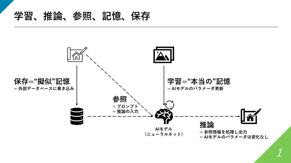

# The Difference Between "Learning," "Reference," and "Inference" in AI Discussions

<!-- 【日本語訳】「学習」や参照、そしてAIを巡る議論で頻出する「推論」という言葉は、一体それぞれどう違うのか -->

https://www.itmedia.co.jp/aiplus/articles/2504/14/news091.html

## Understanding Key AI Concepts: Learning, Reference, and Inference

In the field of AI, the terms "learning," "reference," and "inference" are frequently used, but they represent distinct concepts with different meanings and applications.

<!-- 【日本語訳】
AIの分野では、「学習」「参照」「推論」という用語が頻繁に使用されますが、これらはそれぞれ異なる概念を表し、異なる意味と応用を持っています。

解説:
- "field of AI" (AIの分野) - AI技術の研究・開発領域
- "frequently used" (頻繁に使用される) - よく使われる
- "distinct concepts" (異なる概念) - 明確に区別される考え方
- "different meanings and applications" (異なる意味と応用) - それぞれ独自の意味と使い方
-->

"Learning" refers to the process where an AI model acquires knowledge and patterns from data. This is the training phase where the model adjusts its parameters to minimize errors and improve its performance.

<!-- 【日本語訳】
「学習」とは、AIモデルがデータから知識やパターンを獲得するプロセスを指します。これはモデルがパラメータを調整して誤差を最小限に抑え、性能を向上させる訓練段階です。

解説:
- "acquires knowledge" (知識を獲得する) - 情報や知見を得る
- "training phase" (訓練段階) - 学習を行う期間
- "adjusts its parameters" (パラメータを調整する) - 内部の設定値を変更する
- "minimize errors" (誤差を最小限に抑える) - 間違いを減らす
-->

"Reference" involves the model accessing and utilizing its stored knowledge or external information to answer questions or perform tasks. It's like looking up information in a database or knowledge base.

<!-- 【日本語訳】
「参照」とは、モデルが保存された知識や外部情報にアクセスして利用し、質問に答えたりタスクを実行したりすることを指します。データベースや知識ベースで情報を調べるようなものです。

解説:
- "accessing and utilizing" (アクセスして利用する) - 情報に接続して使う
- "stored knowledge" (保存された知識) - 蓄積された情報
- "external information" (外部情報) - 外部のデータ
- "knowledge base" (知識ベース) - 情報の集合体
-->

"Inference" is the process where the model applies its learned knowledge to new, unseen data to make predictions or draw conclusions. It's the actual application of the model's capabilities to solve real-world problems.

<!-- 【日本語訳】
「推論」とは、モデルが学習した知識を新しい未知のデータに適用して予測を行ったり結論を導いたりするプロセスです。これはモデルの能力を実際の問題解決に応用する段階です。

解説:
- "applies its learned knowledge" (学習した知識を適用する) - 得た情報を使う
- "unseen data" (未知のデータ) - まだ見たことのない情報
- "make predictions" (予測を行う) - 将来の結果を予想する
- "draw conclusions" (結論を導く) - 判断を下す
- "real-world problems" (実際の問題) - 現実の課題
-->

Understanding these differences is crucial for effectively working with AI systems and having meaningful discussions about their capabilities and limitations.

<!-- 【日本語訳】
これらの違いを理解することは、AIシステムを効果的に扱い、その能力と限界について有意義な議論を行うために重要です。

解説:
- "Understanding these differences" (これらの違いを理解すること) - 概念の区別を把握する
- "effectively working with" (効果的に扱う) - 効率的に使用する
- "meaningful discussions" (有意義な議論) - 価値のある話し合い
- "capabilities and limitations" (能力と限界) - できることとできないこと
-->

## ChatGPT's Memory Mechanism: Reference vs. Memory

At first glance, ChatGPT appears to remember previous conversations, but in reality, it doesn't have memory within the model itself. Instead, it rapidly references externally stored conversation history each time. This is similar to how a person with short-term memory impairment might use notes to supplement their memory.

<!-- 【日本語訳】
ChatGPTは、一見すると以前の会話を覚えているように見えますが、実際にはモデルの中に記憶があるわけではなく、外部に保存された会話履歴を毎回高速で参照しているにすぎません。人間でいえば、短期記憶に障害がある人がメモを見返すことで記憶を補っている状態に似ています。

解説:
- "appears to remember" (覚えているように見える) - 実際には異なる仕組み
- "rapidly references" (高速で参照する) - 素早く情報を引き出す
- "externally stored" (外部に保存された) - モデルの外部に保持されている
- "conversation history" (会話履歴) - 過去の会話の記録
- "short-term memory impairment" (短期記憶の障害) - 短期的な記憶の機能障害
- "supplement their memory" (記憶を補う) - 記憶の代わりに機能する
-->

However, ChatGPT's information processing speed is extremely high, allowing it to instantly read through vast amounts of history, which creates the illusion of "remembering" for users. Understanding this difference between "reference" and "memory" is crucial for correctly grasping the structure and limitations of AI.

<!-- 【日本語訳】
ただし、ChatGPTの情報処理速度は極めて高く、膨大な履歴を瞬時に読み取れるため、ユーザーには「記憶している」ように映ります。この「参照」と「記憶」の違いを理解することが、AIの構造や限界を正しく捉える上で非常に重要です。

解説:
- "information processing speed" (情報処理速度) - データを処理する速さ
- "instantly read through" (瞬時に読み取る) - 即座に情報を処理する
- "creates the illusion" (～のように映る) - 実際とは異なる印象を与える
- "crucial for correctly grasping" (正しく捉える上で非常に重要) - 正確に理解するために不可欠
- "structure and limitations" (構造と限界) - 仕組みと制約
-->